## **Introduction**

In our earlier blog posts, we have discussed scalability tests for Argo CD, where in two consecutive experiments, we pushed the limits of Argo CD to deploy [10,000 applications on ~100 clusters](https://aws.amazon.com/blogs/opensource/argo-cd-application-controller-scalability-testing-on-amazon-eks/) and then[ 50,000 applications on 500 clusters](https://cnoe.io/blog/argo-cd-application-scalability) along with configuration and fine-tuning required to make Argo CD scale effectively. Argo CD deployments, however, do not happen in isolation, and similar to a [CNOE stack](https://cnoe.io/docs/reference-implementation), Argo CD is often deployed on a cluster along with other tooling which collectively contribute to the performance and scalability bottlenecks we see users run into. 

Argo Workflows is one common tool we often see users deploy alongside Argo CD to enable workflow executions (e.g. building images, running tests, cutting releases, etc). Our early experiments with Argo Workflows revealed that, if not tuned properly, it can negatively impact the scalability of a given Kubernetes cluster, particularly if the Kubernetes cluster happens to be the control cluster managing developer workflows across a large group of users. A real world example of some of the scaling challenges you can encounter with Argo Workflows is explored in our recent ArgoCon talk: [Key Takeaways from Scaling Adobe's CI/CD Solution to Support 50K Argo CD Apps](https://www.youtube.com/watch?v=7yVXMCX62tY).

For us to better understand the limitations and tuning requirements for Argo Workflows, in this blog post we publish details on the scalability experiments we ran for Argo Workflows executing Workflows in two different load patterns across 50 Amazon EKS nodes. We show the correlation between the various Argo Workflow’s knobs and controls and the processing time as well as performance improvements you can get by determining how you supply the workflows to the control plane.

## **Test Parameters**

### **Test Workflow**

The test workflow is based on the lightweight whalesay container from docker which prints out some text and ASCII art to the terminal. The reason we chose a lightweight container is that we wanted to stress the Argo Workflows controller in managing the Workflow lifecycle (pod creation, scheduling, and cleanup) and minimize the extra overhead on the Kubernetes control plane in dealing with the data plane workloads. An example of the Workflow is below:

```go
var helloWorldWorkflow = wfv1.Workflow{
    ObjectMeta: metav1.ObjectMeta{
        GenerateName: "hello-world-",
    },
    Spec: wfv1.WorkflowSpec{
        Entrypoint: "whalesay",
        ServiceAccountName: "argo",
        Templates: []wfv1.Template{
            {
                Name: "whalesay",
                Container: &corev1.Container{
                    Image:   "docker/whalesay:latest",
                    Command: []string{"cowsay", "hello world"},
                },
            },
        },
        PodGC: &wfv1.PodGC{
            Strategy: "OnPodSuccess",
        },
    },
}
```
### **Argo Workflows Settings**

We will be detailing how each of these settings affect Argo Workflow in various experiments later in this blog post.

- Controller workers: Argo Workflows controller utilizes different workers for various operations in a Workflow lifecycle. We will be looking at t types of workers for our scalability testing.

  - workflow-workers (default: 32): These workers are threads in a single Argo Workflows controller that reconcile Argo Workflow Custom Resources (CRs). When a Workflow is created, a workflow-worker will handle the end-to-end operations of the Workflow from ensuring the pod is scheduled to ensuring the pod has finished. The number of workers can be specified by passing the `--workflow-workers` flag to the controller.

  - pod-cleanup-workers (default: 4): These workers clean up finished Workflows. When a Workflow has finished executing, depending on your clean-up settings, a pod-cleanup-worker will handle cleaning up the pod from the Workflow. The number of workers can be specified by passing the `--pod-cleanup-workers` flag to the controller.

- Client queries per second (QPS)/Burst QPS settings (default: 20/30): These settings control when the Argo Workflows controller’s Kubernetes (K8s) client starts to throttle requests to the K8S API server. The client QPS setting is for limiting sustained QPS for the k8s client while burst QPS is for allowing a burst request rate in excess of the client QPS for a short period of time. The client QPS/burst QPS can be set by passing the `--qps` and `--burst` flag to the controller.

- Sharding: Sharding with multiple Argo Workflows controllers is possible by running each controller in its own namespace. The controller would only reconcile Workflows submitted in that particular namespace. The namespace of each controller can be specified with the `--namespaced` flag.

## **Key Metrics**

We chose a set of key metrics for the scalability testing because we wanted to measure how many workflows the Argo Workflows controller can reconcile and process. We will also be looking into K8s control plane metrics which might indicate your control plane cannot keep up with the Argo Workflows workload. 

- Workqueue depth: The workqueue depth shows workflows which have not been reconciled. If the depth starts to increase, it indicates that the Argo Workflows controller is unable to handle the submission rate of Workflows.

- Workqueue latency: The workqueue latency is the average time workflows spent waiting in the workqueue. A lower value indicates that the Argo Workflows controller is processing workflows faster so that they are not waiting in the workqueue.

- K8S api server requests per second: The read and write requests per second being made to the K8S api server.

We didn’t include CPU/Memory as a key metric because during our testing we did not see any significant impacts to both. Most likely because of our simplistic workflows utilized for this benchmark.

## Environment

We ran the experiments in an AWS environment utilizing a single Amazon EKS cluster. The Kubernetes version is 1.27 and Argo Workflows version is 3.5.4. No resource quotas were utilized on the Argo Workflows controller. For the cluster, we will start by provisioning 1x m5.8xlarge Amazon Elastic Compute Cloud (Amazon EC2) instances which will run the Argo Workflows controller and 50x m5.large instances for executing workflows. The number of execution instances is sufficient to run all 5000 workflows in parallel to ensure that pods are not waiting on resources to execute. Monitoring and metrics for Argo Workflows were provided by Prometheus/Grafana. 

## **Methodology**

There will be two types of load patterns evaluated:

**Increasing Rate Test:** Workflows will be submitted at an increasing rate (workflows/min) until the Argo Workflows controller cannot keep up. The state at which the controller cannot keep up is when there are >0 workflows in the workflow queue or there is increasing queue latency. That rate of Workflow submissions will be noted as the maximum rate at which the Argo Workflows can be processed with the current settings. 

**Queued Reconciliation Test: **5000 workflows are submitted in less than minute. Metrics will be monitored from when the Argo Workflows controller starts processing workflows to when it has reconciled all 5000 workflows. The number of nodes is sufficient for running all the workflows simultaneously.

## Experiments

### Experiment 1: Baseline

In our baseline experiment, we are running in a single Argo Workflows shard (namespace) with default settings.

**Increasing Rate Test:**

As you can see below, the Argo Workflows controller can process up to 270 workflows/min. The average workqueue latency and workqueue depth are nearly zero.  At 300 workflows/min, workqueue latency and workqueue depth starts to increase.

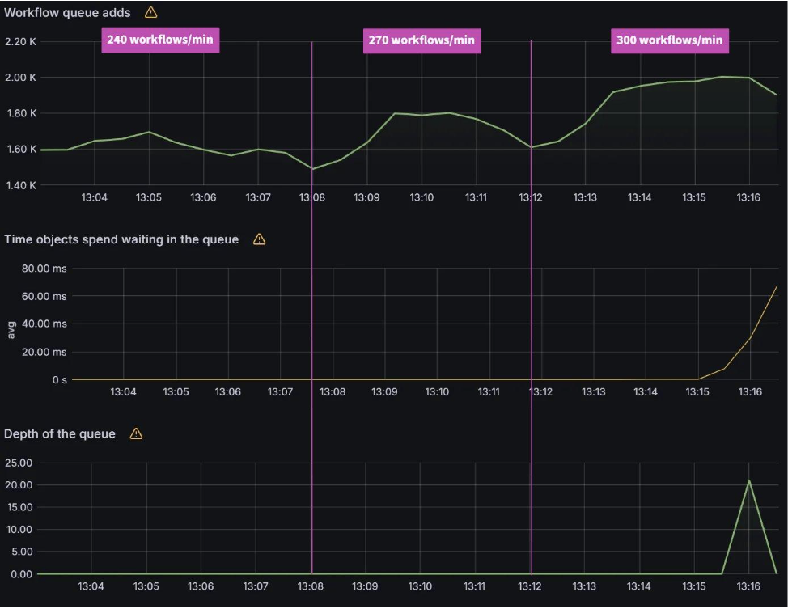

**Queued Reconciliation Test:**

It takes around 17 mins to reconcile 5000 workflows and peak avg workqueue latency was 5.38 minutes.

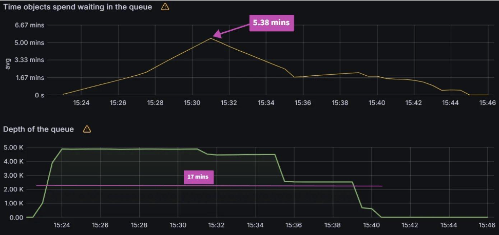

### Experiment 2: Workflow Workers

For this experiment, we increase the number of workflow workers from the default of 32 to 128 where the workers use the maximum QPS and burst settings available to them. We also had to increase the number of pod-cleanup-workers to 32 as the Argo Workflows controller was experiencing some instability, where the controller pod was consistently crashing with the default value of 4. 

**Increasing Rate Test:**

For the increasing workflow rate test, we can see exactly when the number of workflow workers is not sufficient to process the load. Both workqueue latency and depth start to increase indicating that workflows are waiting to be reconciled. When we increase the number of workers, the controller is able to reconcile the current load until an additional load is placed on it. For 32 workers, that limit is 300 workflows/min. When we increase the number of workers to 64, it is able to process that load until load is increased to 330 workflows/min. Then we increase the number of workers to 96 and it can process the additional load again. When we increase to 360 workflows/min, we need to bump the number of workers to 128.

| Workers | Max workflows/minute |
|---|---|
| 32 | 270 |
| 64 | 300 |
| 96 | 330 |
| 128 | 360 |

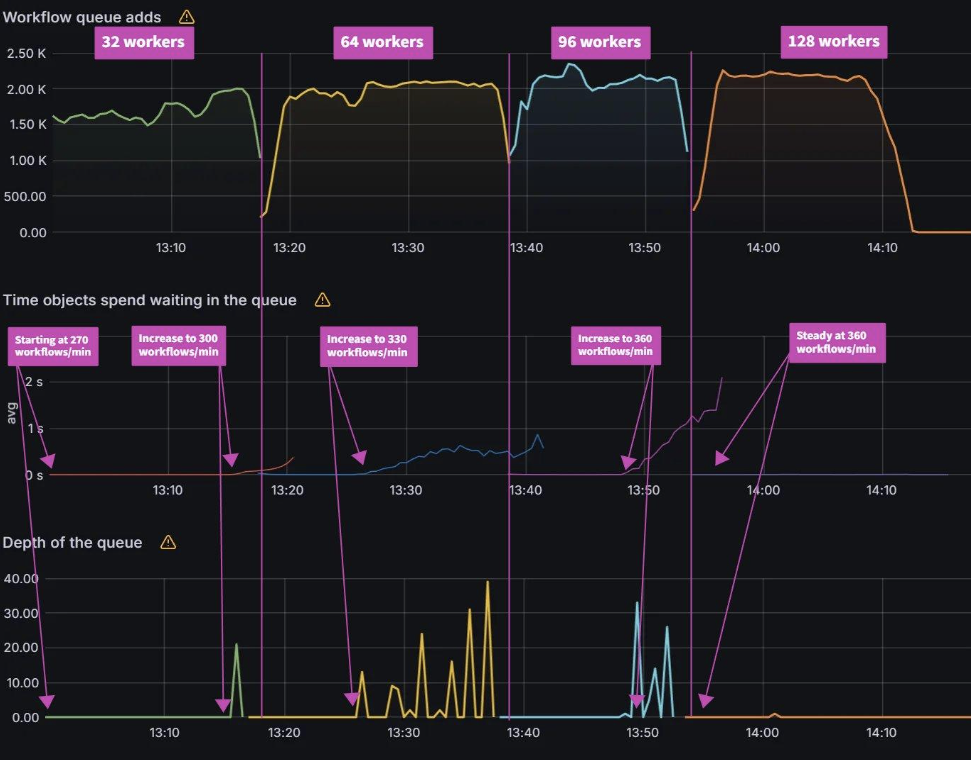

For the K8S api server, we see sustained 180 writes/sec and 70 reads/sec during the increasing rate tests.

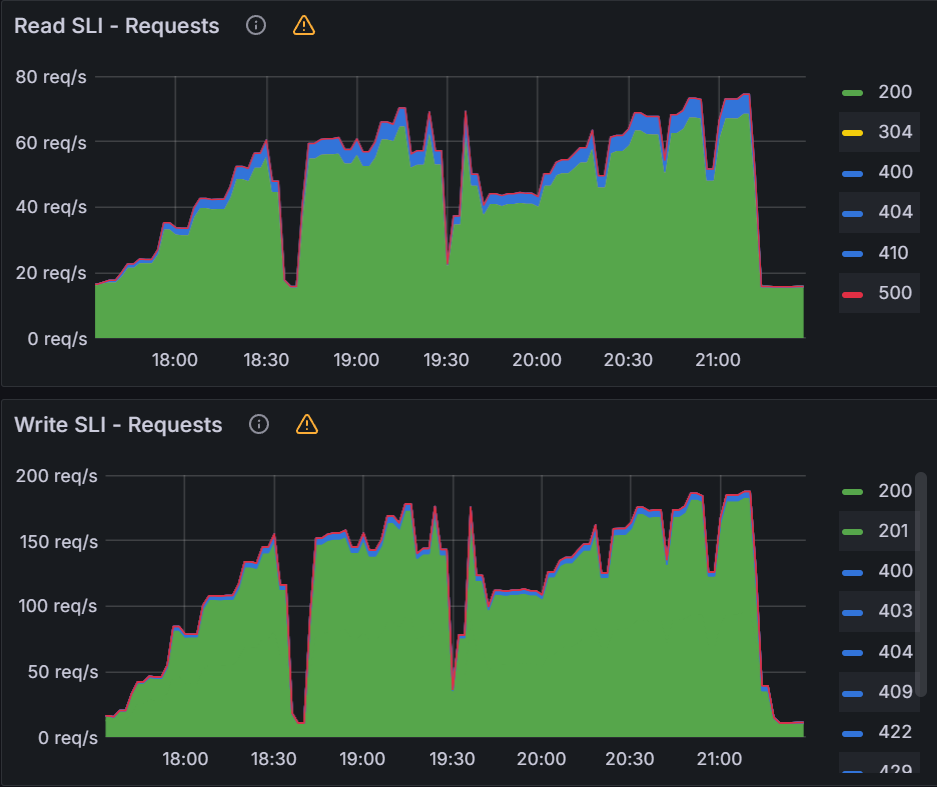

**Queued Reconciliation Test:**

For the queued reconciliation test, the time it took to reconcile all the workflows did not change significantly. With 32 workers it took 17 mins to reconcile while with 96 workers it took 16 mins. The peak workqueue latency did decrease from 5.38 mins with 32 workers to 3.19 mins with 96 workers. With 128 workers, the Argo Workflows controller kept crashing.

| Workers | Peak avg latency (mins) | Reconcile time (mins) |
|---|---|---|
| 32 | 5.38 | 17 |
| 64 | 5.06 | 18 |
| 96 | 3.19 | 16 |
| 128 | N/A | N/A |

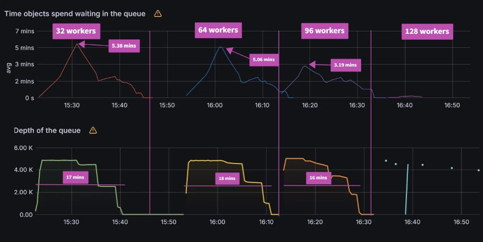

For the K8S api server, we see peaks of up to 260 writes/sec and 90 reads/sec during the queued reconciliation tests. You notice for the last test that there is no K8S api server activity as the Argo Workflows controller was misbehaving due to client-side throttling.

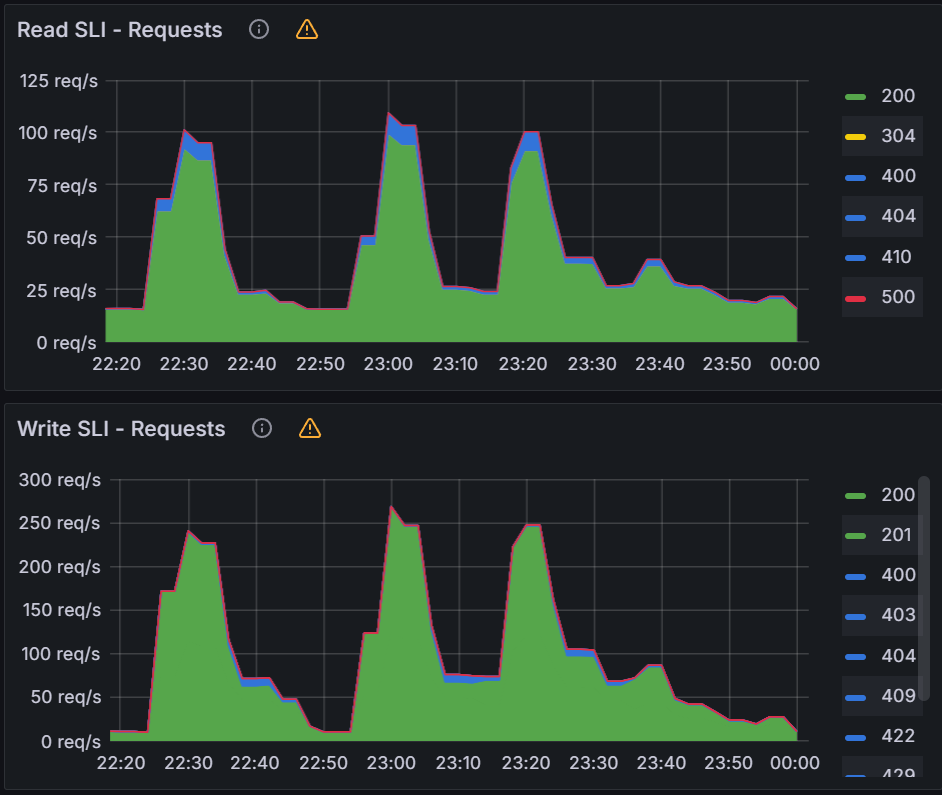

#### **Observations from Experiment 2:**

Workers play a big part in how fast the Argo Workflows controller is able to reconcile the rate of workflows being submitted. If you are observing workflow latency and backing up the workqueue depth, changing the number of workers is a potential way to improve performance. There are a few observations that we want to call out. One is that if we compare the two different patterns, one where we submit workflows at a constant rate and one in which we load up the workqueue all at once, we can see variations in calculated throughput. We can actually calculate the time it takes to reconcile 5000 apps utilizing the increasing rate test results and compare them to the queued reconciliation test.

| Workers | Increasing rate test time to reconciling 5000 workflows (mins) | Reconcile time of 5000 workflows queued all at once (mins) |
|---|---|---|
| 32 | 18.5 | 17 |
| 64 | 16.6 | 18 |
| 96 | 15.1 | 16 |
| 128 | 13.8 | N/A |

We do get some conflicting results when we make this comparison. With 32 and 64 workers, the increasing rate test is actually slower than the queued reconciliation test. But if we increase to 96 workers, we can see that the increasing rate test results are faster. We were unable to compare with 128 workers as the Argo Workflows controller crashed when trying to run the queued reconciliation test. When investigating the cause of the crash, the logs have several messages like the following:

```log
Waited for 6.185558715s due to client-side throttling, not priority and fairness, request: DELETE:https://10.100.0.1:443/api/v1/namespaces/argoworkflows1/pods/hello-world-57cfda8a-dc8b-4854-83a0-05785fb25e4b-3gwthk
```
These messages indicate that we should increase the Client QPS settings which we will evaluate in the next experiment.

### Experiment 3: Client QPS Settings

For this experiment, we set the number of workflow workers back to the default of 32. We will then increase the QPS/Burst by increments of 10/10, from 20/30 to 50/60. We chose to only increase by 10/10 because any large increase past 50/60 did not yield any performance improvements. We believe that this is partly because we kept the workers at 32.

#### **Initial Testing**

**Increasing Rate Test:**

The QPS/Burst settings had a significant impact on the increasing rate test. By increasing the QPS/Burst from 20/30 to 30/40, we see ~50% improvement in max workflows/min from 270 to 420. When we increase the QPS/Burst from 30/40 to 40/50, we see another 28% improvement in max workflows/min from 420 to 540. When increasing from 40/50 to 50/60 there was only an additional 5% improvement. For 32 workers, increasing past 50/60 did not yield any significant improvements to the max workflows/min.

| QPS/Burst | Max workflows/minute |
|---|---|
| 20/30 | 270 |
| 30/40 | 420 |
| 40/50 | 540 |
| 50/60 | 570 |

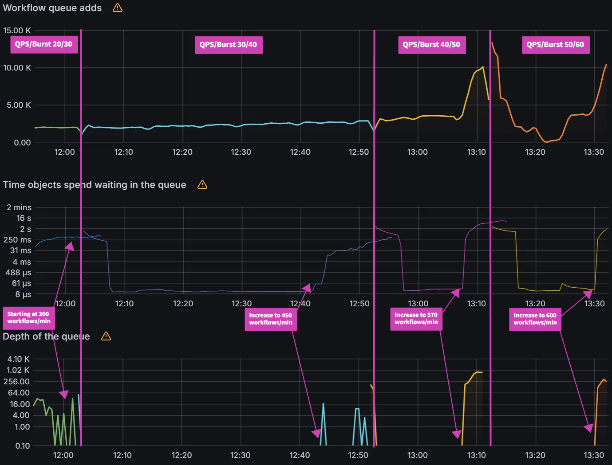

When changing QPS/Burst, we need to also monitor the K8S API server. Looking at the K8S API server req/s, we see sustained 390 writes/sec and 85 read/sec.


**Queued Reconciliation Test:**

Again, the QPS/Burst settings make a big difference in the queued reconciliation test when compared to just changing the workflow workers. Starting from the default settings of 20/30, we see decreasing reconcile times from 19 mins to 12 mins to 8 mins and finally to 6 mins when setting the QPS/Burst to 50/60. The peak average latency also decreased from 4.79 mins to 1.94 mins. We did note that there was a higher peak avg latency with 30/40 vs 20/30 but if you examine the graph you can see a steeper drop in latency accounting for the shorter reconcile time. Similar to the increasing rate test, increasing the QPS/Burst further did not yield any improvements.

| QPS/Burst | Peak avg latency (mins) | Reconcile time (mins) |
|---|---|---|
| 20/30 | 4.79 | 19 |
| 30/40 | 5.66 | 12 |
| 40/50 | 2.98 | 8 |
| 50/60 | 1.94 | 6 |

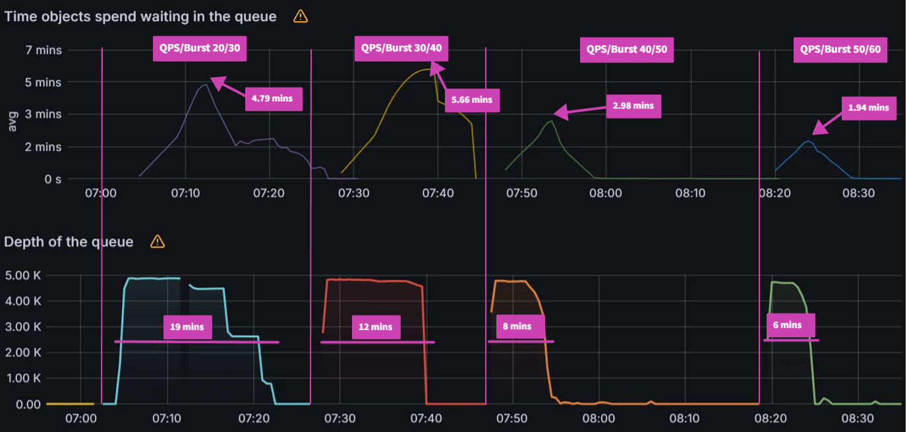

When looking at the K8S API server, we see peaks of up to 700 writes/sec and 200 reads/sec during the tests.

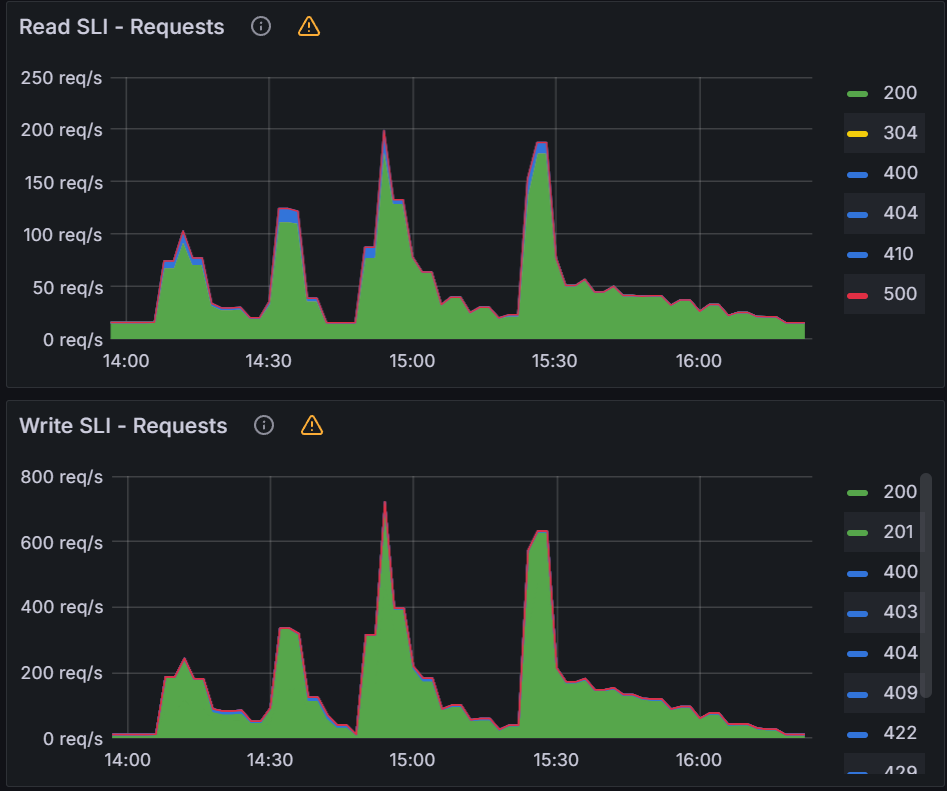

When compared to the workflow workers testing, you can see increasing the QPS/Burst is able to push the K8S API server and improve Argo Workflows overall performance. We do see some diminishing returns when increasing QPS/Burst past 50/60 even though it appears that the K8S API server has plenty of capacity for additional load. For the next test, we will increase both the workflow workers with the QPS/burst to see how far we can push Argo Workflows and the K8s API server.

#### **Max Load Test**

**Increasing Rate Test:**

We increased the number of workers to 128 and QPS/burst to 60/70 and observed peak average latency of 54 secs and a reconciliation time of 5 mins. Increasing either the workers or QPS/Burst did not improve these numbers.

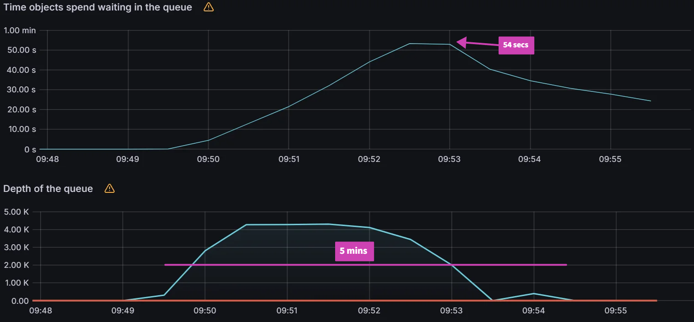

Looking at the K8s API server, we saw peaks of 800 writes/sec and 190 reads/sec.

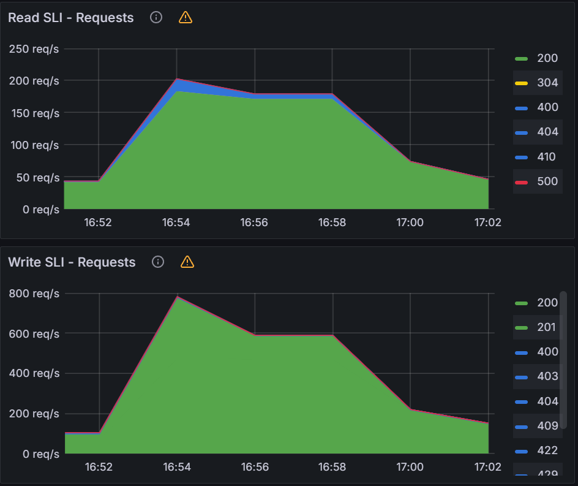

**Queued Reconciliation Test:**

Starting with 128 workers and QPS/Burst of 60/70, we were able to push Argo Workflows to 810 workflows/min. But past that point, there were no improvements with more workers or increased QPS/Burst limits.


We can see increased K8s API server activity with sustained 700 writes/sec and 160 reads/sec.


#### **Observations from Experiment 3**

One observation we made in the previous experiment with workflow workers is that the two different patterns of submitting workflows can be compared. We made that comparison again with the QPS/Burst tests and saw the following results:

| QPS/Burst | Workers | Increasing rate test time to reconcile 5000 workflows (mins) | Reconcile time of 5000 workflows queued all at once (mins) |
|---|---|---|---|
| 20/30 | 32 | 18.5 | 19 |
| 30/40 | 32 | 11.9 | 12 |
| 50/60 | 32 | 9.2 | 8 |
| 60/70 | 32 | 8.7 | 6 |
| 70/80 | 128 | 6.1 | 5 |

When we take the data about the comparison in experiment 1 with the data above, we can see a slight improvement in submitting all workflows together vs staggering them. We are not sure why this is the case and more experiments are required to understand this behavior.

It seems that we have hit a wall with 128 workers and a QPS/burst of 60/70 for a single Argo Workflows Controller. We will now evaluate Sharding and see if we can improve our performance from this point.

### Experiment 4: Sharding

For this experiment, we will evaluate 1 shard, 2 shards, and 5 shards of the Argo Workflows controller with the default settings. We will then try for a maximum load test utilizing workflow workers, QPS/burst, and sharding to see the maximum performance on our current infrastructure.
#### **Initial Testing**

**Increasing Rate Test:**

Sharding the Argo Workflows controller has a linear impact on performance with the increasing rate test. By increasing the number of shards from 1 to 2, we see a 100% improvement in max workflows/min from 270 to 540. When we increase the shards from 2 to 5, we see an additional 150% improvement in max workflows/min from 540 to 1350.

| Shards | Max workflows/min |
|---|---|
| 1 | 270 |
| 2 | 540 |
| 5 | 1350 |

One thing to note is that each shard is increased by 30 workflows/min when increasing the rate. This means that the difference between two rates with 2 shards * 30 = 60 workflows/min and the difference between two rates with 5 shards * 30 = 150 workflows/min. That is why for 2 shards when the max load was determined at 600 workflows/min, we go down 1 rate which is 600 - 60 = 540 workflows/min.

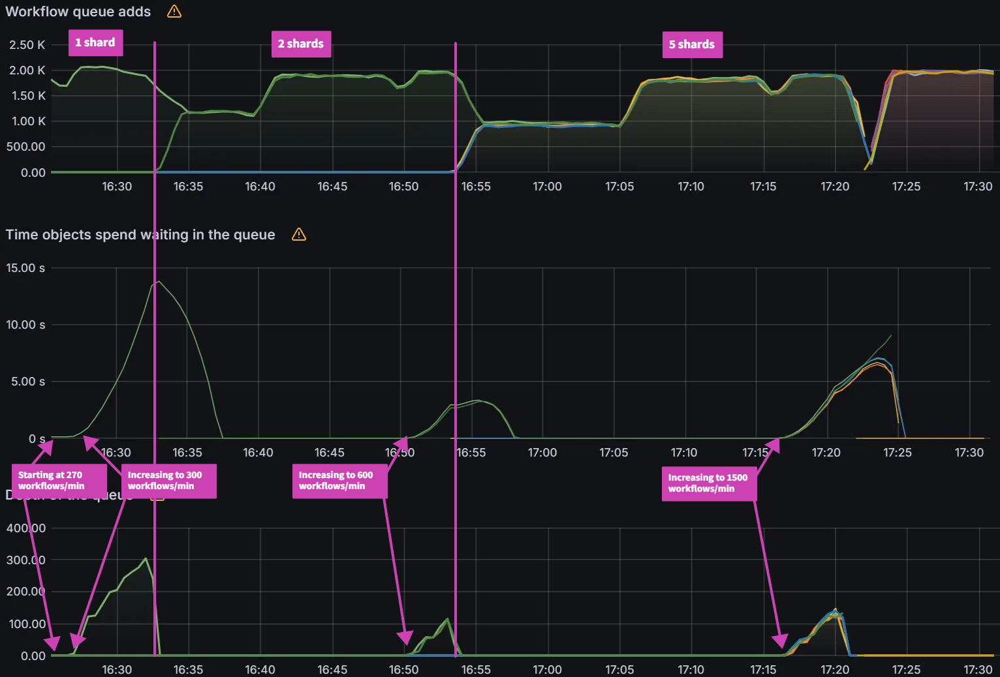

You can see a significant impact on the K8s API server with sustained 1400 writes/sec and 300 reads/sec.

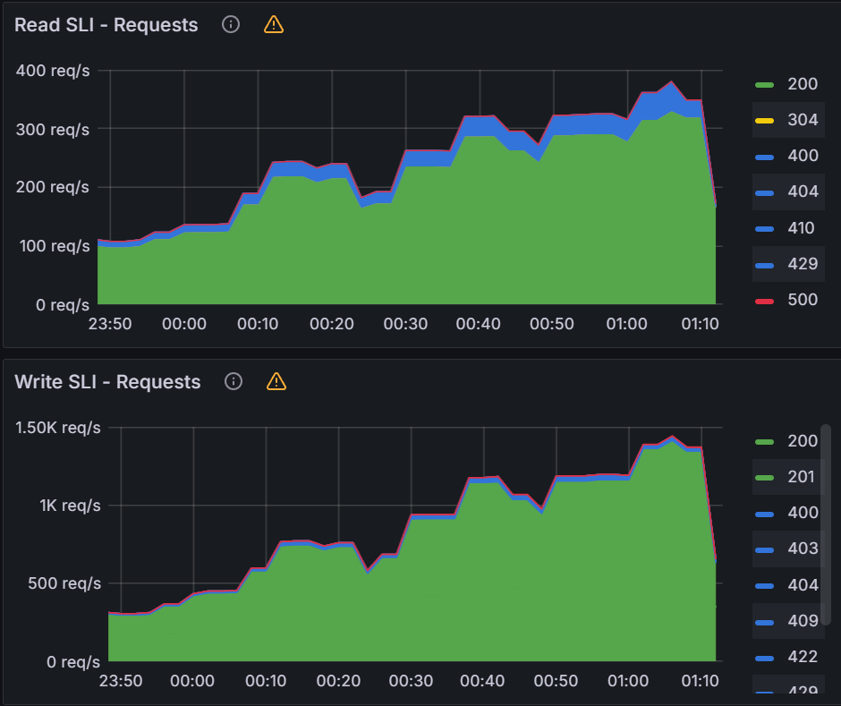

**Queued Reconciliation Test:**

As shown in the Increasing Rate Test, sharding has a huge impact on performance for the queued reconciliation test. With 1 shard it takes 18 mins to reconcile 5000 workflows, while with 2 shards it takes 9 mins. With 5 shards the reconcile time is further reduced to 4 mins.

| Shards | Peak avg latency (mins) | Reconcile time (mins) |
|---|---|---|
| 1 | 5.43 | 18 |
| 2 | 3.81 | 9 |
| 5 | 1.42 | 4 |

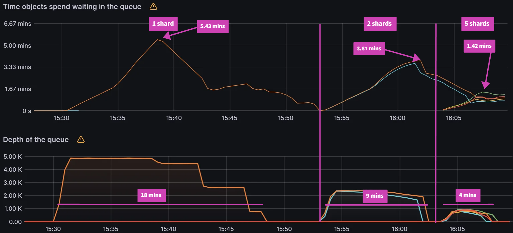

The impact on the K8s API server was not as significant when compared to previous experiments.

#### **Max Load Test**

**Increasing Rate Test:**

When increasing the workflow workers to 128, QPS/burst to 60/70 and shards to 5, the Argo Workflows controller is able to process up to 2100 wor

kflows/min. Any higher than this seems to run into K8s API Priority and Fairness (APF) limits. 

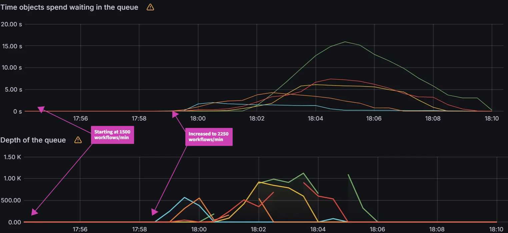

When looking at the K8s API server, we are seeing significant impact with peaks of 1500 writes/sec and 350 reads/sec.

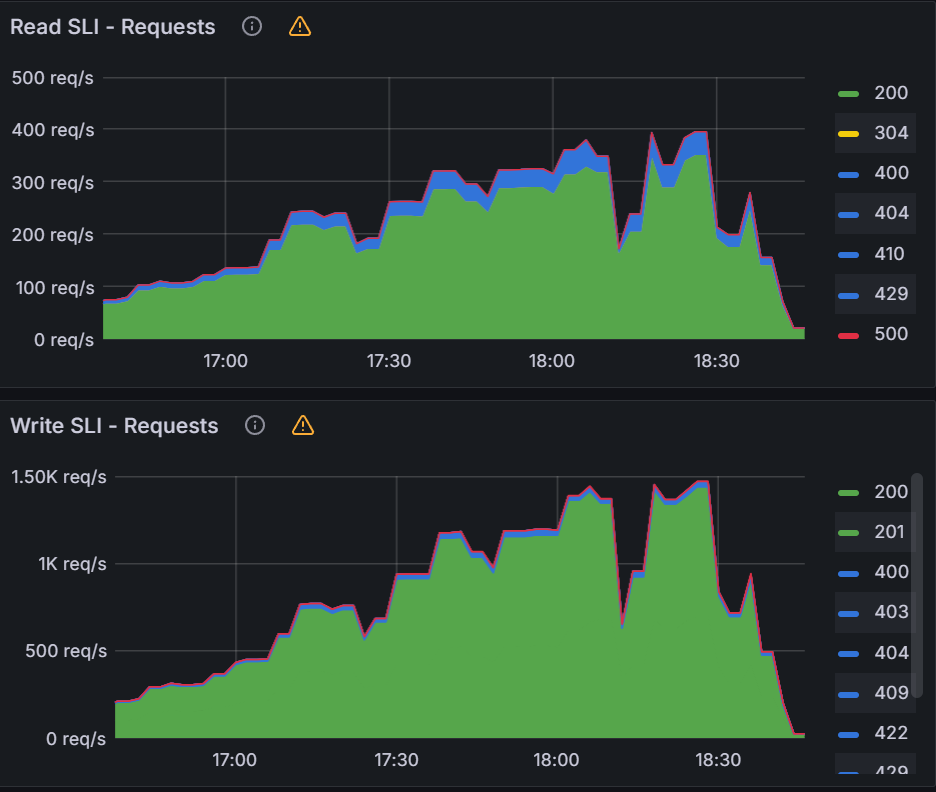

When investigating why we are unable to push higher on the K8s API server, we see that APF limits are coming into effect by looking at the apiserver_flowcontrol_current_inqueue_requests. This metric shows the number of requests waiting in the APF flowcontrol queue.


**Queued Reconciliation Test:**

With the max load settings, we observed that the peak workqueue latency is only 20 seconds and the reconcile time is 2 minutes.

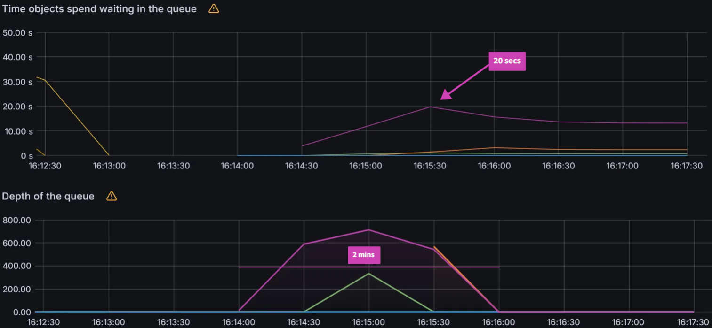

The impact on K8s API server is actually less than the previous max load queued reconciliation tests.


#### **Observations from Experiment 4**

As we did in previous experiments, we again make the comparison between the two different load patterns:

| Shards | Increasing rate test time to reconcile 5000 workflows (mins) | Reconcile time of 5000 workflows queued all at once (mins) |
|---|---|---|
| 1 | 18.5 | 18 |
| 2 | 9.2 | 9 |
| 5 | 3.7 | 4 |
| Max load (5 shards) | 2.3 | 2 |

In general, it appears that submitting all workflows at once performs slightly better than submitting workflows at a steady rate. More experiments will need to be done to further investigate this behavior.

## **Conclusion**

In this blog post we discussed our initial efforts in documenting and understanding the scaling characteristics of the Argo Workflows controller. Our findings show that the existing mechanisms for increasing workflow workers, increasing client and burst QPS settings and sharding the controller can help Argo Workflows scale better. Another interesting observation is that we saw differences in performance with how you submit your workflows.  For the next set of experiments, we plan to evaluate more environmental variables and different types of workflows: multi-step and/or long running. Stay tuned for the report on our next round of experiments and reach out on the CNCF [#argo-sig-scalability](https://cloud-native.slack.com/archives/C04SURUPDL2) Slack channel to get help optimizing for your use-cases and scenarios.
